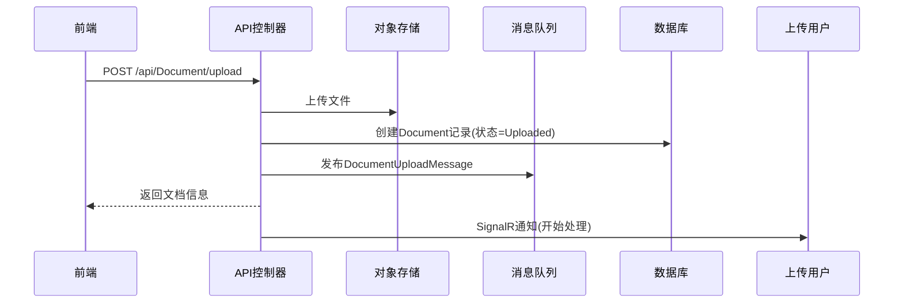
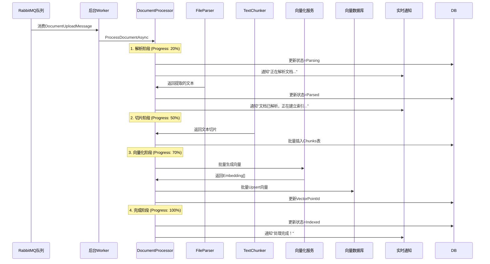

# 文件上传到消息队列处理流程设计

## 1. 应用场景

OmniMind 系统中有两种主要的文件上传场景：

### 1.1 AI 聊天临时文件

用户在 AI 对话过程中上传的临时文件，用于单次对话问答。

**特点：**
- 文件只在当前聊天会话中有效
- 随会话隔离，每个 SessionId 有独立的向量空间
- 不需要持久化到知识库
- 会话结束后可选择保留或清理

**使用流程：**
```
用户上传 → 存储到 MinIO → 创建 Document(带 SessionId)
         → 发送到消息队列 → 解析/切片/向量化
         → 存储到集合 document_session_{SessionId}
```

### 1.2 知识库文件

用户上传到知识库的文件，用于长期保存和知识复用。

**特点：**
- 文件持久化存储到知识库
- 按知识库隔离向量空间
- 支持文件夹组织
- 所有成员可检索和引用

**使用流程：**
```
用户上传 → 存储到 MinIO → 创建 Document(带 KnowledgeBaseId)
         → 发送到消息队列 → 解析/切片/向量化
         → 存储到集合 document_kb_{KnowledgeBaseId}
```

### 1.3 场景对比

| 对比项 | AI 聊天临时文件 | 知识库文件 |
|--------|-----------------|------------|
| 主要用途 | 单次对话问答 | 长期知识复用 |
| 文档隔离 | 按 SessionId 隔离 | 按 KnowledgeBaseId 隔离 |
| 向量集合 | `document_session_{SessionId}` | `document_kb_{KnowledgeBaseId}` |
| 文件夹组织 | 不支持 | 支持文件夹层级 |
| 权限控制 | 只有上传者可访问 | 按知识库权限控制 |
| 持久化 | 可选保留或清理 | 持久存储 |

## 2. 整体架构

```
┌─────────────┐      ┌──────────┐      ┌──────────┐      ┌──────────┐
│  前端上传   │ ───> │ MinIO    │      │ RabbitMQ │      │ Consumer │
└─────────────┘      └──────────┘      └──────────┘      └──────────┘
                           │                                  │
                           ▼                                  ▼
                    ┌────────────────┐              ┌──────────────┐
                    │  DocumentRecord │              │   Document   │
                    │   (状态:Uploaded)  │              │   Processor  │
                    └────────────────┘              └──────────────┘
                                                           │
                                                           ▼
                                                    ┌────────────────────────┐
                                                    │   解析 → 切片 → 向量化    │
                                                    │   (FileParser/Chunker/   │
                                                    │    EmbeddingGenerator)  │
                                                    └────────────────────────┘
```

## 3. 处理流程

### 3.1 文件上传流程



### 3.2 消息消费处理流程



## 4. 文档状态机

```
┌──────────┐
│ Uploaded │ 文件已上传，等待处理
└────┬─────┘
     │
     ▼
┌──────────┐
│ Parsing  │ 正在解析文档内容
└────┬─────┘
     │
     ▼
┌──────────┐
│ Parsed   │ 文档解析完成，准备切片
└────┬─────┘
     │
     ▼
┌──────────┐
│ Indexed  │ 向量化完成，可检索
└──────────┘

┌──────────┐
│ Failed   │ 处理失败（包含错误信息）
└──────────┘
```

## 5. 消息定义

### 5.1 DocumentUploadMessage

```csharp
public record DocumentUploadMessage
{
    string DocumentId          // 文档ID
    string KnowledgeBaseId     // 知识库ID
    string ObjectKey          // 对象存储Key
    string FileName           // 原始文件名
    string ContentType        // MIME类型
    DateTimeOffset CreatedAt   // 消息创建时间
}
```

### 5.2 文档处理进度通知

```csharp
public class DocumentProgress
{
    string DocumentId         // 文档ID
    string Title              // 文档标题
    string Status             // Parsing/Parsed/Indexing/Failed
    int Progress             // 进度百分比 (0-100)
    string Stage              // 当前阶段描述
    string? Error            // 错误信息
}
```

## 6. 重试机制

### 6.1 重试策略配置

| 参数 | 默认值 | 说明 |
|------|--------|------|
| `MaxRetryCount` | 3 | 最大重试次数 |
| `UseExponentialBackoff` | true | 是否启用指数退避 |
| `BaseDelaySeconds` | 2 | 基础延迟时间（秒）|

### 6.2 重试延迟计算

```
延迟秒数 = BaseDelaySeconds ^ (当前重试次数 + 1)

例如：BaseDelaySeconds = 2
- 第1次重试: 2^1 = 2秒
- 第2次重试: 2^2 = 4秒
- 第3次重试: 2^3 = 8秒
```

### 6.3 重试流程

```
处理失败
    │
    ▼
达到最大重试次数？
    │
    ├── 是 ──→ 标记为 Failed，记录错误信息
    │
    └── 否 ──→ 延迟等待 → 重新发布消息到队列
```

## 7. 向量集合设计

### 7.1 集合命名规则

| 文档类型 | 集合名称格式 | 说明 |
|---------|---------------|------|
| 知识库文件 | `document_kb_{KnowledgeBaseId}` | 按知识库隔离 |
| 临时文件 | `document_session_{SessionId}` | 按会话隔离 |
| 兜底 | `document_fallback_{DocumentId}` | 不应该走到这里 |

### 7.2 向量元数据

```json
{
  "document_id": "文档ID",
  "chunk_index": 0,
  "content": "切片内容"
}
```

## 8. 文本切片配置

| 参数 | 值 | 说明 |
|------|-----|------|
| `MaxTokens` | 500 | 每个切片最大token数 |
| `OverlapTokens` | 50 | 切片间重叠token数 |

## 9. API 端点

### 9.1 文件上传

```
POST /api/Document/upload
Content-Type: multipart/form-data

请求参数：
- File: IFormFile           // 上传的文件
- KnowledgeBaseId: string   // 知识库ID
- FolderId?: string          // 文件夹ID（可选）
- Title?: string            // 文档标题（可选，默认使用文件名）

响应：
201 Created + DocumentResponse
```

### 9.2 创建文档（笔记/链接）

```
POST /api/Document
Content-Type: application/json

请求体：
{
  "knowledgeBaseId": "知识库ID",
  "folderId": "文件夹ID",
  "title": "文档标题",
  "contentType": "text/markdown",
  "sourceType": "Note",
  "content": "# 笔记内容"
}

响应：
201 Created + DocumentResponse
```

## 10. 核心组件

### 10.1 DocumentProcessingWorker

后台服务，负责消费 RabbitMQ 队列中的文档上传消息。

```csharp
public class DocumentProcessingWorker : BackgroundService
{
    // 持续监听队列
    // 处理消息时创建作用域获取服务
    // 自动重启机制：异常后5秒重启
}
```

### 10.2 DocumentProcessingConsumer

RabbitMQ 消费者，处理消息并调用文档处理器。

```csharp
public class DocumentProcessingConsumer
{
    // 消费 DocumentUploadMessage
    // 实现重试机制
    // 处理结果并更新文档状态
}
```

### 10.3 DocumentProcessor

文档处理器核心逻辑，可被 Quartz Job 和 RabbitMQ Consumer 共用。

```csharp
public static class DocumentProcessor
{
    // 处理步骤：
    // 1. 解析文档 (Parsing → 20%)
    // 2. 文本切片 (Parsed → 50%)
    // 3. 向量化 (Indexing → 70%)
    // 4. 完成 (Indexed → 100%)
}
```

## 11. 配置

### 11.1 RabbitMQ 配置

```json
{
  "rabbitMQ": {
    "HostName": "localhost",
    "Port": 5672,
    "UserName": "admin",
    "Password": "test@123",
    "virtualHost": "/",
    "DocumentUploadQueue": "document-upload",
    "DocumentExchange": "document-exchange",
    "DocumentUploadRoutingKey": "document.upload"
  }
}
```

### 11.2 Program.cs 注册

```csharp
// 注册 RabbitMQ 消息服务
builder.Services.AddRabbitMQ(builder.Configuration);

// 注册 Ingestion 服务（文件解析和文本切片）
builder.Services.AddIngestion();

// 注册阿里云向量化服务
builder.Services.AddAlibabaCloudEmbedding(builder.Configuration);

// 注册后台服务（文档处理消费者）
builder.Services.AddHostedService<DocumentProcessingWorker>();
```

## 12. 错误处理

### 12.1 错误恢复

| 错误类型 | 处理方式 |
|---------|---------|
| 临时网络错误 | 重试（最多3次）|
| 文件解析失败 | 标记为Failed，记录错误信息 |
| 向量化失败 | 重试（最多3次）|
| 达到最大重试 | 标记为Failed |

### 12.2 状态更新

所有状态变更都会：
1. 更新数据库中的文档状态
2. 通过 SignalR 实时通知前端用户
3. 记录日志便于排查

## 13. 前端集成

### 13.1 SignalR 连接

```typescript
// 连接到文档处理进度Hub
const connection = new HubConnectionBuilder()
  .withUrl(`${baseUrl}/hubs/ingestion`)
  .withAutomaticReconnect()
  .build();

// 监听文档处理进度
connection.on("DocumentProgress", (progress: DocumentProgress) => {
  console.log(`${progress.Stage}: ${progress.Progress}%`);
  // 更新UI显示进度
});
```

### 13.2 进度显示

| 阶段 | 进度 | 显示文本 |
|------|------|----------|
| 上传完成 | 0% | 文件已上传 |
| 解析中 | 20% | 正在解析文档内容... |
| 已解析 | 50% | 文档已解析，正在建立索引... |
| 索引中 | 70% | 正在建立向量索引... |
| 完成 | 100% | 处理完成！ |
| 失败 | 0% | 处理失败 |

## 14. 支持的文件类型

### 14.1 文档类

| 扩展名 | MIME类型 | 说明 |
|--------|----------|------|
| .pdf | application/pdf | PDF文档 |
| .doc, .docx | application/msword, application/vnd.openxmlformats-officedocument.wordprocessingml.document | Word文档 |
| .ppt, .pptx | application/vnd.ms-powerpoint, application/vnd.openxmlformats-officedocument.presentationml.presentation | PowerPoint文档 |
| .txt | text/plain | 纯文本 |
| .md, .markdown | text/markdown | Markdown文档 |

### 14.2 网页类

| 扩展名 | MIME类型 | 说明 |
|--------|----------|------|
| .htm, .html | text/html | HTML网页 |
| text/url | text/url | 网页链接（内容爬取待实现）|

### 14.3 图片类

| 扩展名 | MIME类型 | 说明 |
|--------|----------|------|
| .jpg, .jpeg | image/jpeg | JPEG图片 |
| .png | image/png | PNG图片 |
| .gif | image/gif | GIF图片 |
| .bmp | image/bmp | BMP图片 |
| .webp | image/webp | WebP图片 |
| .svg | image/svg+xml | SVG矢量图 |

### 14.4 音视频类

| 扩展名 | MIME类型 | 说明 |
|--------|----------|------|
| .mp3 | audio/mpeg | MP3音频 |
| .wav | audio/wav | WAV音频 |
| .mp4 | video/mp4 | MP4视频 |
| .avi | video/x-msvideo | AVI视频 |

## 15. 性能考虑

1. **批量处理**：向量化时使用批量操作提高效率
2. **流式处理**：大文件使用流式下载，避免内存溢出
3. **并发控制**：消费者通过 `_inFlightMessages` 控制并发数量
4. **失败隔离**：单个文档处理失败不影响其他文档
5. **自动重启**：消费者异常后5秒自动重启

## 16. 监控与日志

### 16.1 日志级别

```
[DocumentProcessingWorker] 启动文档处理消费者服务
[DocumentProcessingWorker] 开始监听队列: document-upload
[文档处理] 开始处理: DocumentId=xxx, Title=xxx
[文档处理] 正在下载文件: DocumentId=xxx
[文档处理] 正在处理文件: DocumentId=xxx, ContentType=xxx
[文档处理] 解析完成，文本长度: 12345 字符
[文档处理] 切片完成: DocumentId=xxx, 切片数量=25
[文档处理] 向量化完成: DocumentId=xxx, 向量数量=25
[文档处理] 处理完成: DocumentId=xxx, 耗时=5000ms
```

### 16.2 监控指标

- 文档处理成功率
- 平均处理时间
- 队列积压情况
- 重试次数统计
