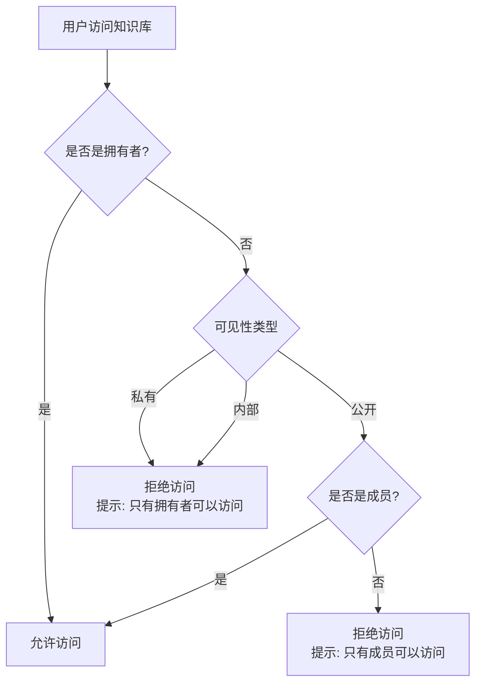
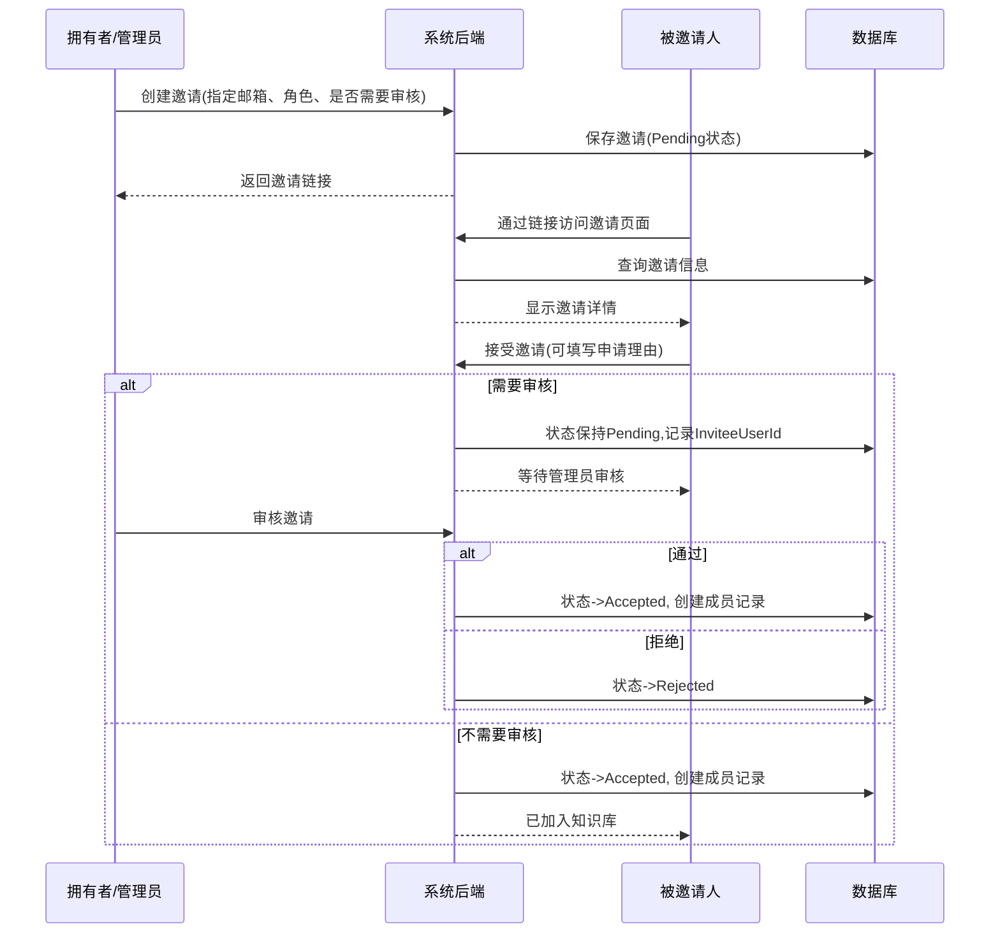

# 知识库流程设计方案

## 1. 概述

本文档描述 OmniMind 系统中知识库的完整流程设计，包括可见性控制、权限管理、邀请机制、成员管理等内容。

## 2. 知识库可见性

### 2.1 可见性类型

| 可见性 | 说明 | 拥有者 | 成员 | 非成员 |
|--------|------|--------|------|--------|
| **私有** | 个人知识库 | ✓ | ✗ | ✗ |
| **内部** | 秘密共享知识库 | ✓ | ✗ | ✗ |
| **公开** | 公开共享知识库 | ✓ | ✓ | ✗ |

### 2.2 权限检查逻辑



### 2.3 访问控制点

- **知识库详情页** - `GET /api/KnowledgeBase/{id}`
- **文档列表** - `GET /api/Document?knowledgeBaseId={id}`
- **文档详情** - `GET /api/Document/{id}`
- **文件夹树** - `GET /api/Folder/tree/{knowledgeBaseId}`
- **文件夹列表** - `GET /api/Folder/list/{knowledgeBaseId}`

## 3. 邀请机制

### 3.1 邀请流程



### 3.2 邀请状态流转

| 状态 | 说明 | InviteeUserId | 成员记录 |
|------|------|---------------|----------|
| `Pending` | 待处理/待审核 | 用户接受后填写 | 无 |
| `Accepted` | 已加入 | 已填写 | 已创建 |
| `Rejected` | 已拒绝 | 已填写 | 无 |
| `Expired` | 已过期 | - | 无 |
| `Canceled` | 已取消 | - | 无 |

### 3.3 邀请参数

| 参数 | 类型 | 说明 |
|------|------|------|
| `Email` | string? | 被邀请人邮箱（可选，留空则为公开邀请）|
| `Role` | enum | 默认角色：Admin/Editor/Viewer |
| `RequireApproval` | bool | 是否需要管理员审核 |
| `ExpireDays` | int | 有效期（天数） |
| `ApplicationReason` | string? | 申请理由（用户接受时填写）|

## 4. 成员管理

### 4.1 成员角色

| 角色 | 权限 | 说明 |
|------|------|------|
| `Admin` | 管理员 | 管理成员、创建邀请、删除内容 |
| `Editor` | 协助者 | 编辑内容、上传文件 |
| `Viewer` | 查看者 | 只读访问 |

### 4.2 成员操作

- **添加成员**：通过邀请机制
- **移除成员**：拥有者/管理员可移除其他成员
- **角色管理**：拥有者可修改成员角色

## 5. 文件夹与文档

### 5.1 文件夹结构

```
知识库根目录
├── 文件夹A
│   ├── 文件夹A-1
│   │   └── 文档1.pdf
│   └── 文档2.docx
├── 文件夹B
│   └── 文档3.txt
└── 文档4.md (根目录)
```

### 5.2 操作权限

| 操作 | 拥有者 | Admin | Editor | Viewer |
|------|--------|-------|--------|--------|
| 查看文档/文件夹 | ✓ | ✓ | ✓ | ✓ |
| 上传文档 | ✓ | ✓ | ✓ | ✗ |
| 创建文件夹 | ✓ | ✓ | ✓ | ✗ |
| 删除文档/文件夹 | ✓ | ✓ | ✗ | ✗ |
| 移动文档/文件夹 | ✓ | ✓ | ✗ | ✗ |
| 重命名 | ✓ | ✓ | ✓ | ✗ |
| 管理成员 | ✓ | ✓ | ✗ | ✗ |
| 创建邀请 | ✓ | ✓ | ✗ | ✗ |

## 6. API 设计

### 6.1 权限检查扩展

```csharp
// 使用方式
var authResult = await dbContext.CheckKnowledgeBaseAccessAsync(knowledgeBaseId, userId);
if (!authResult.HasAccess) {
    return StatusCode(403, new ErrorResponse { Message = authResult.Message });
}
```

### 6.2 核心 API

#### 知识库相关

```
GET  /api/KnowledgeBase          # 获取知识库列表
POST /api/KnowledgeBase          # 创建知识库
GET  /api/KnowledgeBase/{id}      # 获取知识库详情
PUT  /api/KnowledgeBase/{id}      # 更新知识库
DELETE /api/KnowledgeBase/{id}    # 删除知识库
```

#### 成员相关

```
GET  /api/KnowledgeBase/{id}/members    # 获取成员列表
DELETE /api/KnowledgeBase/{id}/members/{userId}  # 移除成员
```

#### 邀请相关

```
POST   /api/Invitation                      # 创建邀请
GET    /api/Invitation/knowledge-base/{id}  # 获取邀请列表
GET    /api/Invitation/code/{code}          # 获取邀请详情(通过邀请码)
POST   /api/Invitation/respond              # 响应邀请(接受/拒绝)
POST   /api/Invitation/{id}/approve         # 审核邀请
DELETE /api/Invitation/{id}                  # 取消邀请
```

#### 文档相关

```
GET    /api/Document                         # 获取文档列表
GET    /api/Document/{id}                     # 获取文档详情
POST   /api/Document/upload                  # 上传文档
POST   /api/Document                          # 创建文档(笔记/链接)
DELETE /api/Document/{id}                     # 删除文档
PATCH  /api/Document/{id}/move               # 移动文档
```

#### 文件夹相关

```
GET    /api/Folder/tree/{knowledgeBaseId}    # 获取文件夹树
GET    /api/Folder/list/{knowledgeBaseId}    # 获取文件夹列表
POST   /api/Folder                            # 创建文件夹
PUT    /api/Folder/{id}                       # 更新文件夹
PATCH  /api/Folder/{id}/move                  # 移动文件夹
DELETE /api/Folder/{id}                       # 删除文件夹
```

## 7. 数据模型

### 7.1 核心实体

```csharp
// 知识库
public class KnowledgeBase
{
    string Id
    string Name
    string? Description
    Visibility Visibility  // Private/Internal/Public
    string OwnerUserId
    List<KnowledgeBaseMember> Members
    List<KnowledgeBaseInvitation> Invitations
}

// 成员
public class KnowledgeBaseMember
{
    string Id
    string KnowledgeBaseId
    string UserId
    KnowledgeBaseMemberRole Role  // Admin/Editor/Viewer
    string? InvitedByUserId
    DateTimeOffset CreatedAt
}

// 邀请
public class KnowledgeBaseInvitation
{
    string Id
    string KnowledgeBaseId
    string Code              // 邀请码
    string? Email           // 被邀请人邮箱
    KnowledgeBaseMemberRole Role
    bool RequireApproval
    InvitationStatus Status
    string InviterUserId
    string? InviteeUserId
    string? ApplicationReason
    DateTimeOffset ExpiresAt
    DateTimeOffset? AcceptedAt
}

// 文件夹
public class Folder
{
    string Id
    string KnowledgeBaseId
    string? ParentFolderId
    string Name
    string Path
    string? Description
    int SortOrder
    string CreatedByUserId
    DateTimeOffset CreatedAt
}

// 文档
public class Document
{
    string Id
    string KnowledgeBaseId
    string? FolderId
    string Title
    string ContentType
    SourceType SourceType
    string? ObjectKey
    long? FileSize
    DocumentStatus Status
    string CreatedByUserId
    DateTimeOffset CreatedAt
}
```

### 7.2 枚举定义

```csharp
// 可见性
public enum Visibility
{
    Private = 1,   // 私有，只有拥有者
    Internal = 2,  // 内部，私密共享
    Public = 3     // 公开，公开共享
}

// 成员角色
public enum KnowledgeBaseMemberRole
{
    Admin = 1,     // 管理员
    Editor = 2,    // 协助者
    Viewer = 3     // 查看者
}

// 邀请状态
public enum InvitationStatus
{
    Pending = 0,   // 待处理/待审核
    Accepted = 1,  // 已接受/已加入
    Rejected = 2,  // 已拒绝
    Expired = 3,   // 已过期
    Canceled = 4   // 已取消
}

// 文档状态
public enum DocumentStatus
{
    Uploaded = 0,
    Processing = 1,
    Completed = 2,
    Failed = 3
}
```

## 8. 前端交互

### 8.1 知识库详情页

- **私密知识库提示**：当用户无权限访问时，显示"知识库当前为私密状态，只有拥有者可以访问"
- **文档列表为空**：无权限时返回空列表并附带提示消息
- **成员管理**：拥有者/管理员可管理成员和邀请

### 8.2 邀请流程

1. 创建邀请 → 生成邀请链接
2. 被邀请人点击链接 → 显示邀请详情
3. 被邀请人接受邀请（可填写申请理由）
4. 需要审核：等待管理员审核；不需要审核：直接加入
5. 管理员在"成员管理"→"邀请列表"中审核

## 9. 安全考虑

1. **权限检查**：所有访问知识库内容的 API 都需要进行权限检查
2. **邀请码安全**：使用 8 位随机码，去除易混淆字符
3. **邀请过期**：邀请有效期默认 7 天，过期后自动失效
4. **邮箱验证**：指定邮箱的邀请只能被该邮箱用户接受
5. **审核机制**：可选的审核流程，拥有者/管理员可批准或拒绝加入申请

## 10. 更新日志

| 日期 | 版本 | 更新内容 |
|------|------|----------|
| 2025-02-05 | 1.0 | 初始版本，包含完整权限设计和邀请流程 |
