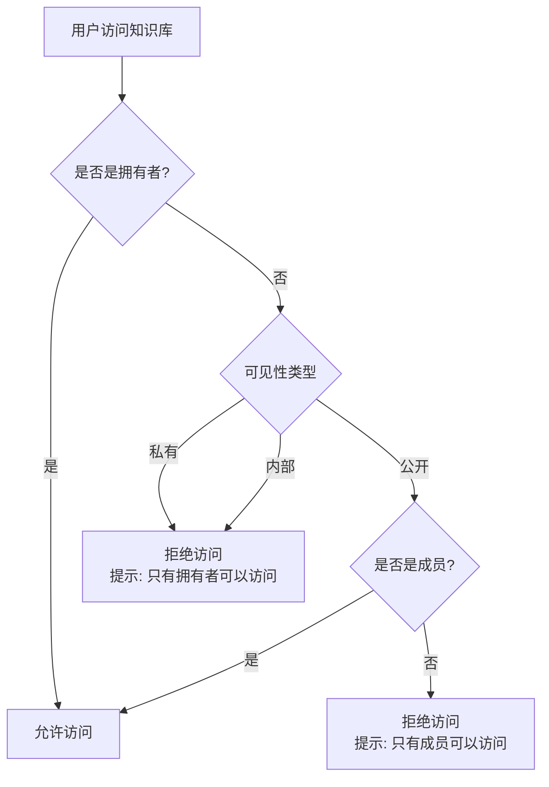
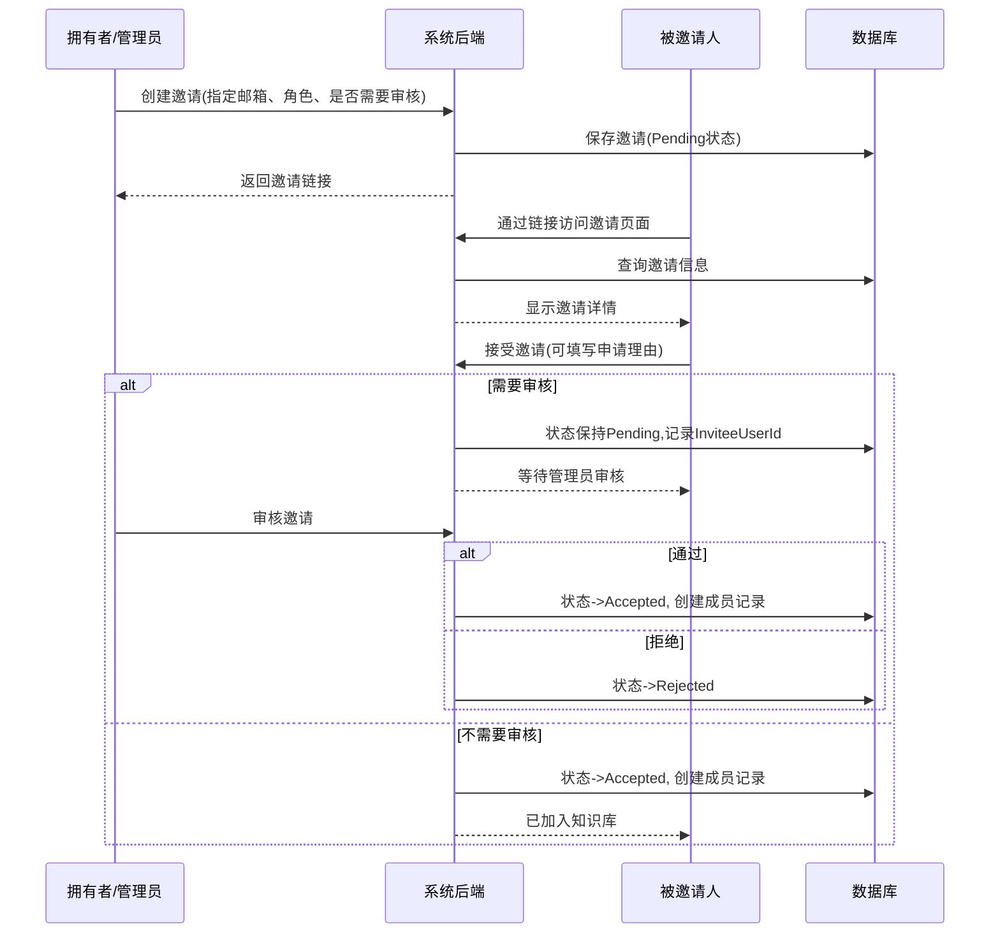

# 知识库流程设计方案

## 1. 概述

本文档描述 OmniMind 系统中知识库的完整流程设计，包括可见性控制、权限管理、邀请机制、成员管理等内容。

## 2. 知识库可见性

### 2.1 可见性类型

| 可见性 | 说明 | 拥有者 | 成员 | 非成员 |
|--------|------|--------|------|--------|
| **私有** | 个人知识库 | ✓ | ✗ | ✗ |
| **内部** | 秘密共享知识库 | ✓ | ✗ | ✗ |
| **公开** | 公开共享知识库 | ✓ | ✓ | ✗ |

### 2.2 权限检查逻辑


```mermaid
flowchart TD
    A[用户访问知识库] --> B{是否是拥有者?}
    B -->|是| C[允许访问]
    B -->|否| D{可见性类型}
    D -->|私有| E[拒绝访问<br/>提示: 只有拥有者可以访问]
    D -->|内部| E
    D -->|公开| F{是否是成员?}
    F -->|是| C
    F -->|否| G[拒绝访问<br/>提示: 只有成员可以访问]
```

### 2.3 访问控制点

- **知识库详情页** - `GET /api/KnowledgeBase/{id}`
- **文档列表** - `GET /api/Document?knowledgeBaseId={id}`
- **文档详情** - `GET /api/Document/{id}`
- **文件夹树** - `GET /api/Folder/tree/{knowledgeBaseId}`
- **文件夹列表** - `GET /api/Folder/list/{knowledgeBaseId}`

## 3. 邀请机制

### 3.1 邀请流程


```mermaid
sequenceDiagram
    participant Owner as 拥有者/管理员
    participant System as 系统后端
    participant Invitee as 被邀请人
    participant DB as 数据库

    Owner->>System: 创建邀请(指定邮箱、角色、是否需要审核)
    System->>DB: 保存邀请(Pending状态)
    System-->>Owner: 返回邀请链接

    Invitee->>System: 通过链接访问邀请页面
    System->>DB: 查询邀请信息
    System-->>Invitee: 显示邀请详情

    Invitee->>System: 接受邀请(可填写申请理由)
    alt 需要审核
        System->>DB: 状态保持Pending,记录InviteeUserId
        System-->>Invitee: 等待管理员审核
        Owner->>System: 审核邀请
        alt 通过
            System->>DB: 状态->Accepted, 创建成员记录
        else 拒绝
            System->>DB: 状态->Rejected
        end
    else 不需要审核
        System->>DB: 状态->Accepted, 创建成员记录
        System-->>Invitee: 已加入知识库
    end
```

### 3.2 邀请状态流转

| 状态 | 说明 | InviteeUserId | 成员记录 |
|------|------|---------------|----------|
| `Pending` | 待处理/待审核 | 用户接受后填写 | 无 |
| `Accepted` | 已加入 | 已填写 | 已创建 |
| `Rejected` | 已拒绝 | 已填写 | 无 |
| `Expired` | 已过期 | - | 无 |
| `Canceled` | 已取消 | - | 无 |

### 3.3 邀请参数

| 参数 | 类型 | 说明 |
|------|------|------|
| `Email` | string? | 被邀请人邮箱（可选，留空则为公开邀请）|
| `Role` | enum | 默认角色：Admin/Editor/Viewer |
| `RequireApproval` | bool | 是否需要管理员审核 |
| `ExpireDays` | int | 有效期（天数） |
| `ApplicationReason` | string? | 申请理由（用户接受时填写）|

## 4. 成员管理

### 4.1 成员角色

| 角色 | 权限 | 说明 |
|------|------|------|
| `Admin` | 管理员 | 管理成员、创建邀请、删除内容 |
| `Editor` | 协助者 | 编辑内容、上传文件 |
| `Viewer` | 查看者 | 只读访问 |

### 4.2 成员操作

- **添加成员**：通过邀请机制
- **移除成员**：拥有者/管理员可移除其他成员
- **角色管理**：拥有者可修改成员角色

## 5. 文件夹与文档

### 5.1 文件夹结构

```
知识库根目录
├── 文件夹A
│   ├── 文件夹A-1
│   │   └── 文档1.pdf
│   └── 文档2.docx
├── 文件夹B
│   └── 文档3.txt
└── 文档4.md (根目录)
```

### 5.2 操作权限

| 操作 | 拥有者 | Admin | Editor | Viewer |
|------|--------|-------|--------|--------|
| 查看文档/文件夹 | ✓ | ✓ | ✓ | ✓ |
| 上传文档 | ✓ | ✓ | ✓ | ✗ |
| 创建文件夹 | ✓ | ✓ | ✓ | ✗ |
| 删除文档/文件夹 | ✓ | ✓ | ✗ | ✗ |
| 移动文档/文件夹 | ✓ | ✓ | ✗ | ✗ |
| 重命名 | ✓ | ✓ | ✓ | ✗ |
| 管理成员 | ✓ | ✓ | ✗ | ✗ |
| 创建邀请 | ✓ | ✓ | ✗ | ✗ |

## 6. API 设计

### 6.1 权限检查扩展

```csharp
// 使用方式
var authResult = await dbContext.CheckKnowledgeBaseAccessAsync(knowledgeBaseId, userId);
if (!authResult.HasAccess) {
    return StatusCode(403, new ErrorResponse { Message = authResult.Message });
}
```

### 6.2 核心 API

#### 知识库相关

```
GET  /api/KnowledgeBase          # 获取知识库列表
POST /api/KnowledgeBase          # 创建知识库
GET  /api/KnowledgeBase/{id}      # 获取知识库详情
PUT  /api/KnowledgeBase/{id}      # 更新知识库
DELETE /api/KnowledgeBase/{id}    # 删除知识库
```

#### 成员相关

```
GET  /api/KnowledgeBase/{id}/members    # 获取成员列表
DELETE /api/KnowledgeBase/{id}/members/{userId}  # 移除成员
```

#### 邀请相关

```
POST   /api/Invitation                      # 创建邀请
GET    /api/Invitation/knowledge-base/{id}  # 获取邀请列表
GET    /api/Invitation/code/{code}          # 获取邀请详情(通过邀请码)
POST   /api/Invitation/respond              # 响应邀请(接受/拒绝)
POST   /api/Invitation/{id}/approve         # 审核邀请
DELETE /api/Invitation/{id}                  # 取消邀请
```

#### 文档相关

```
GET    /api/Document                         # 获取文档列表
GET    /api/Document/{id}                     # 获取文档详情
POST   /api/Document/upload                  # 上传文档
POST   /api/Document                          # 创建文档(笔记/链接)
DELETE /api/Document/{id}                     # 删除文档
PATCH  /api/Document/{id}/move               # 移动文档
```

#### 文件夹相关

```
GET    /api/Folder/tree/{knowledgeBaseId}    # 获取文件夹树
GET    /api/Folder/list/{knowledgeBaseId}    # 获取文件夹列表
POST   /api/Folder                            # 创建文件夹
PUT    /api/Folder/{id}                       # 更新文件夹
PATCH  /api/Folder/{id}/move                  # 移动文件夹
DELETE /api/Folder/{id}                       # 删除文件夹
```

## 7. 数据模型

### 7.1 核心实体

```csharp
// 知识库
public class KnowledgeBase
{
    string Id
    string Name
    string? Description
    Visibility Visibility  // Private/Internal/Public
    string OwnerUserId
    List<KnowledgeBaseMember> Members
    List<KnowledgeBaseInvitation> Invitations
}

// 成员
public class KnowledgeBaseMember
{
    string Id
    string KnowledgeBaseId
    string UserId
    KnowledgeBaseMemberRole Role  // Admin/Editor/Viewer
    string? InvitedByUserId
    DateTimeOffset CreatedAt
}

// 邀请
public class KnowledgeBaseInvitation
{
    string Id
    string KnowledgeBaseId
    string Code              // 邀请码
    string? Email           // 被邀请人邮箱
    KnowledgeBaseMemberRole Role
    bool RequireApproval
    InvitationStatus Status
    string InviterUserId
    string? InviteeUserId
    string? ApplicationReason
    DateTimeOffset ExpiresAt
    DateTimeOffset? AcceptedAt
}

// 文件夹
public class Folder
{
    string Id
    string KnowledgeBaseId
    string? ParentFolderId
    string Name
    string Path
    string? Description
    int SortOrder
    string CreatedByUserId
    DateTimeOffset CreatedAt
}

// 文档
public class Document
{
    string Id
    string KnowledgeBaseId
    string? FolderId
    string Title
    string ContentType
    SourceType SourceType
    string? ObjectKey
    long? FileSize
    DocumentStatus Status
    string CreatedByUserId
    DateTimeOffset CreatedAt
}
```

### 7.2 枚举定义

```csharp
// 可见性
public enum Visibility
{
    Private = 1,   // 私有，只有拥有者
    Internal = 2,  // 内部，私密共享
    Public = 3     // 公开，公开共享
}

// 成员角色
public enum KnowledgeBaseMemberRole
{
    Admin = 1,     // 管理员
    Editor = 2,    // 协助者
    Viewer = 3     // 查看者
}

// 邀请状态
public enum InvitationStatus
{
    Pending = 0,   // 待处理/待审核
    Accepted = 1,  // 已接受/已加入
    Rejected = 2,  // 已拒绝
    Expired = 3,   // 已过期
    Canceled = 4   // 已取消
}

// 文档状态
public enum DocumentStatus
{
    Pending = 0,
    Uploaded = 1,
    Parsing = 2,
    Parsed = 3,
    Indexing = 4,
    Indexed = 5,
    Failed = 6
}
```

## 8. 前端交互

### 8.1 知识库详情页

- **私密知识库提示**：当用户无权限访问时，显示"知识库当前为私密状态，只有拥有者可以访问"
- **文档列表为空**：无权限时返回空列表并附带提示消息
- **成员管理**：拥有者/管理员可管理成员和邀请

### 8.2 邀请流程

1. 创建邀请 → 生成邀请链接
2. 被邀请人点击链接 → 显示邀请详情
3. 被邀请人接受邀请（可填写申请理由）
4. 需要审核：等待管理员审核；不需要审核：直接加入
5. 管理员在"成员管理"→"邀请列表"中审核

## 9. 内容摄取与检索链路

### 9.1 原始数据接入

OmniMind 知识库的数据接入建议统一抽象为 `Document`，再按内容类型分流处理。当前与目标支持范围如下：

| 数据类型 | 接入方式 | 当前状态 | 说明 |
|------|------|------|------|
| PDF / Word / Markdown / TXT | 文件上传 | 已支持 | 后端本地解析，抽取纯文本后切片 |
| PPT / PPTX | 文件上传 | 建议补齐 | 与 Word/PDF 同类，进入统一文档解析链路 |
| 网页 | URL 导入 | 设计支持 | 建议保存 `SourceUri` 与抓取时间 |
| 数据库记录 | 批量导入 / ETL | 设计支持 | 建议按表、主键、更新时间写入 metadata |
| FAQ / 工单 / 聊天记录 | 结构化导入 | 设计支持 | 建议按问答对、会话轮次、工单状态结构化 |
| 图片 | 文件上传 | 部分支持 | 当前后端仅保留占位解析，后续建议补 OCR/版面理解 |
| 音频 / 视频 | 文件上传 | 已支持异步转写 | 先转写为文本，再回到统一切片索引链路 |

### 9.2 内容抽取与清洗

统一目标不是“把文件读出来”，而是得到可检索、可引用、可追溯的干净文本。建议处理顺序如下：

1. 抽取正文：从原始文件、网页或业务记录中提取正文内容。
2. 清洗噪声：去页眉页脚、去水印、去乱码、去重复段落、去空白行。
3. 修正文档层级：识别标题层级、目录层级、列表层级，避免切片前结构丢失。
4. 补充 metadata：至少补齐来源、作者、时间、业务主键、文件名、页码、章节路径等信息。
5. 保留原始可追溯信息：原文对象存储 key、导入来源、更新时间、清洗版本应可追踪。

当前项目中的落点：

- `Document` 作为统一文档实体，已经包含 `Title`、`ContentType`、`SourceType`、`SourceUri`、`ObjectKey`、`FileHash`、`Language`、`Content`、`Transcription` 等字段。
- 文本类内容在后端解析后进入 `Document.Content`。
- 音视频内容先进入转写链路，原始转写结果保留在 `Document.Transcription`，可供审计与二次处理。

### 9.3 文档结构化

结构化的目标是让后续切片、召回和引用都基于“语义单元”，而不是基于原始字节流。建议至少识别下列结构：

- 标题、章节、子章节
- 表格、列表、代码块
- 问答对、FAQ 对
- 时间、作者、来源系统、业务主键
- 聊天记录中的角色、轮次、时间戳
- 工单中的状态、优先级、处理人、结论

当前项目可利用的数据载体：

- `Document` 负责保存文档级元数据。
- `Chunk` 负责保存切片级内容，`Chunk.ExtraJson` 可用于补充页码、时间戳、说话人、来源路径、表格定位等结构化信息。
- 对音视频切片，可使用 `Chunk.StartMs` / `Chunk.EndMs` 保存时间区间。

### 9.4 处理链路与状态流转

#### 文本类文档

1. 上传或导入原始文件，创建 `Document` 记录。
2. 发送 `document-upload` 消息。
3. `DocumentProcessingConsumer` 消费消息并进入 `DocumentProcessor`。
4. 后端解析文件正文，写入 `Document.Content`。
5. 状态流转为 `Uploaded -> Parsing -> Parsed -> Indexing -> Indexed`。
6. 切片后生成向量并写入 Qdrant。

#### 音频 / 视频文档

1. 上传媒体文件，创建 `Document` 记录。
2. 发送 `document-upload` 消息。
3. `DocumentProcessingConsumer` 识别 `audio/*` 或 `video/*`，不走同步解析。
4. 文档状态先更新为 `Pending`，随后投递 `transcribe-request`。
5. Python + FunASR 消费转写任务，从 MinIO/S3 下载原文件并执行转写。
6. 转写结果上传回对象存储后，发送 `transcribe-completed`。
7. `TranscribeCompletedConsumer` 下载转写结果，提取正文写入 `Document.Content`，原始结果保留到 `Document.Transcription`。
8. 后端继续执行切片、Embedding、向量索引，最终状态进入 `Indexed`。

说明：

- `ParseMediaAsync` 不应承担转写投递职责，它只作为保护性分支，避免媒体文件误走同步解析。
- 文本、PDF、Word、Markdown 仍然由 C# 侧本地解析。
- 图片当前仍在后端链路内处理，后续如引入 OCR 服务，可单独增加异步分支，但对外仍建议回到统一 `Document -> Chunk` 模型。

### 9.5 切片、索引与检索

#### 切片原则

- 按语义块拆分，不破坏上下文。
- 保留重叠区，避免答案跨 chunk 时信息断裂。
- 优先在标题、段落、问答对、表格、代码块边界切分，而不是只按字数硬切。

当前项目现状：

- 已有统一 `IChunker` 抽象。
- 当前默认参数为 `MaxTokens = 500`、`OverlapTokens = 50`、`MinTokens = 100`。
- 现阶段仍以 token 长度切片为主，后续建议升级为“结构优先 + token 兜底”的语义切片策略。

#### 检索与索引

当前已实现：

- Embedding 向量化
- Qdrant 向量索引
- 按知识库或会话维度构建向量集合

目标态建议：

1. 向量检索：解决语义相似召回问题。
2. BM25：解决关键词、术语、编号、专有名词精确命中问题。
3. Hybrid Search：融合向量检索与 BM25，提高复杂查询的稳健性。
4. Rerank：对 TopK 结果做二次排序，提升最终上下文质量。

注：从当前代码实现看，向量索引已经落地；BM25、Hybrid Search、Rerank 应视为下一阶段增强能力，不应在实现说明中写成“已完成”。

### 9.6 召回评测

召回评测建议围绕三个问题展开：

1. 能不能搜到
2. 搜到的结果准不准
3. 引用片段是否完整，能否直接支撑回答

建议指标如下：

| 目标 | 关注点 | 建议指标 |
|------|------|------|
| 能搜到 | 目标片段是否进入候选集 | `Hit@K`、`Recall@K` |
| 搜得准 | 高相关片段是否排在前面 | `Precision@K`、`MRR`、`nDCG` |
| 引用完整 | 片段是否足以回答问题且引用不残缺 | 人工评测、LLM-as-judge、引用完整率 |

建议建立一套知识库检索基准集，每条样本至少包含：

- 用户问题
- 标准答案
- 应命中的文档 ID / 标题
- 应命中的 chunk 范围或关键段落
- 正确引用应覆盖的原文范围

人工验收时，至少检查：

- 前 K 条结果中是否包含正确文档
- Top 1 / Top 3 是否已经足够回答问题
- 返回片段是否截断关键定义、时间、结论或限制条件
- 引用来源是否正确可追踪
- 最终回答是否使用了错误来源或遗漏关键上下文

### 9.7 半结构化数据接入规范

对于数据库记录、FAQ、工单、聊天记录，不建议简单拼成一大段文本后直接入库。更稳妥的方式是：先转成统一 `Document`，再在 `Document.Content` 中保存规范化正文，在 `Chunk.ExtraJson` 中保留结构化 metadata。

#### 数据库记录

适用场景：

- 主数据表
- 业务配置表
- 商品、项目、人员、知识条目等结构化记录

建议接入模型：

- 一条记录对应一个 `Document`，适合高价值、低频更新的数据。
- 一组强相关子记录聚合为一个 `Document`，适合主子表或明细表场景。

建议保留的 metadata：

- `table_name`
- `primary_key`
- `tenant_id`
- `created_at`
- `updated_at`
- `owner`
- `status`
- `tags`

建议正文模板：

```text
标题：{name/title}
来源表：{table_name}
主键：{primary_key}
更新时间：{updated_at}

字段摘要：
- 字段A：值A
- 字段B：值B
- 字段C：值C

业务描述：
{description}
```

切片策略建议：

- 单条记录较短时，不必强切，优先整条记录作为一个语义单元。
- 主子表场景可按“主记录 + 每组子记录”切片，避免把关联关系切断。
- 对编号、编码、型号、客户名这类强关键词字段，应原样保留，便于未来叠加 BM25。

#### FAQ

适用场景：

- 常见问题库
- 帮助中心
- 产品说明问答

建议接入模型：

- 一个 FAQ 对应一个 `Document`，问题和答案共同构成最小知识单元。
- 多语言 FAQ 可按语言拆成多个 `Document`，避免检索混淆。

建议保留的 metadata：

- `faq_id`
- `category`
- `product`
- `language`
- `effective_at`
- `owner_team`
- `status`

建议正文模板：

```text
问题：{question}
答案：{answer}
分类：{category}
适用产品：{product}
更新时间：{updated_at}
```

切片策略建议：

- FAQ 通常不需要二次切片，优先整条问答入索引。
- 若答案过长，可按“结论 / 条件 / 步骤 / 注意事项”拆分，但必须保留问题文本在每个 chunk 中。
- 对“适用范围”“不适用范围”“版本限制”要避免被切丢。

#### 工单

适用场景：

- 客服工单
- IT 服务单
- 售后问题单
- 问题处理闭环记录

建议接入模型：

- 一张工单对应一个 `Document`。
- 工单正文由“问题描述 + 处理过程 + 最终结论”组成。
- 过长的交互过程建议按阶段切片，而不是按消息条数生切。

建议保留的 metadata：

- `ticket_id`
- `ticket_type`
- `priority`
- `status`
- `reporter`
- `assignee`
- `created_at`
- `closed_at`
- `product`
- `version`

建议正文模板：

```text
工单号：{ticket_id}
标题：{title}
优先级：{priority}
状态：{status}
产品/版本：{product} {version}

问题描述：
{problem_description}

处理过程：
{timeline_or_comments}

最终结论：
{resolution}
```

切片策略建议：

- 按“问题描述 / 排查过程 / 最终结论 / 复盘建议”分块。
- 若工单评论很多，优先按时间阶段或处理人轮换切片。
- 最终结论和 workaround 要单独成块，保证检索时容易命中。

#### 聊天记录

适用场景：

- IM 会话
- 客服聊天
- 群聊摘要
- 会议讨论转文本

建议接入模型：

- 一段会话可对应一个 `Document`。
- 如果会话极长，可按时间窗口、主题段或 session 拆成多个 `Document`。

建议保留的 metadata：

- `conversation_id`
- `channel`
- `participants`
- `started_at`
- `ended_at`
- `topic`
- `speaker_count`
- `source_system`

建议正文模板：

```text
会话ID：{conversation_id}
渠道：{channel}
参与者：{participants}
开始时间：{started_at}
结束时间：{ended_at}

对话内容：
[10:01] 张三：...
[10:02] 李四：...
[10:05] 张三：...
```

切片策略建议：

- 按话题段、轮次簇或时间窗口切片，不建议逐条消息直接入向量库。
- 每个 chunk 建议保留发言人和时间戳，写入 `Chunk.ExtraJson`。
- 对有明确结论的讨论，建议额外产出一个“会话摘要 chunk”，提高问答命中率。

### 9.8 推荐导入任务模型

为了支撑后续多源接入，建议把“上传文件”和“导入外部数据”统一到导入任务模型中。一个导入任务至少应包含：

- 数据源类型：`file / url / database / faq / ticket / chat`
- 来源标识：文件 key、URL、表名、业务系统名
- 导入批次号
- 导入规则版本
- 记录总数 / 成功数 / 失败数
- 启动时间 / 完成时间
- 操作人

建议处理流程：

1. 导入器先把源数据转成标准 `Document` 草稿。
2. 对每条 `Document` 执行清洗、结构化、切片、索引。
3. 导入任务汇总成功数、失败数和错误原因。
4. 支持按导入批次重试或回滚重建索引。

这样后续无论是文件上传、数据库同步，还是客服系统导入，最终都会回到同一条知识处理主链。

### 9.9 数据模型扩展建议

当前项目已经具备三个核心实体：

- `Document`：统一文档对象
- `Chunk`：统一可检索切片
- `IngestionTask`：单文档异步处理任务

这套模型足以支撑“单文件上传 -> 异步解析 -> 切片索引”。但如果要稳定支持数据库、FAQ、工单、聊天记录等批量导入，建议增加一层“导入批次”模型，而不是把批量导入状态强塞进单个 `IngestionTask`。

#### 建议保留的现有职责

`Document`

- 保存统一正文和文档级元数据
- 记录来源类型、来源地址、对象存储 key、状态、转写文本

`Chunk`

- 保存最终可检索内容
- 通过 `ExtraJson` 承载页码、时间戳、说话人、来源路径等扩展信息

`IngestionTask`

- 继续作为“单个 Document 的处理流水线状态”
- 跟踪 `Upload -> Parse -> Chunk -> Embed -> Index` 阶段进度

#### 建议新增：导入批次表

建议新增 `IngestionBatch`，用于承载一次外部接入任务。

```csharp
public class IngestionBatch
{
    string Id
    string KnowledgeBaseId
    string SourceKind          // file/url/database/faq/ticket/chat
    string SourceIdentifier    // 表名、URL、系统名、文件批次号
    string? ExternalTaskId     // 外部调度任务 ID
    string RuleVersion         // 当前清洗/映射规则版本
    int TotalCount
    int SuccessCount
    int FailedCount
    TaskStatus Status          // Running/Success/Failed/PartialSuccess
    string? ErrorSummary
    string CreatedByUserId
    DateTimeOffset StartedAt
    DateTimeOffset? FinishedAt
    string? MetadataJson
}
```

推荐关系：

- 一个 `IngestionBatch` 对应多个 `Document`
- 一个 `Document` 对应一个或多个 `IngestionTask`

这样可以同时看到：

- 批次层状态：这次数据库同步总体成功了多少
- 文档层状态：某一条 FAQ 或某一张工单具体卡在哪个阶段

#### 建议新增或补充的字段

如果希望后续做增量同步、去重和回溯，建议在 `Document` 上补充以下字段之一：

- `ExternalId`：外部系统记录主键
- `SourceSystem`：来源系统名，如 `crm`、`helpdesk`、`wiki`
- `MetadataJson`：文档级扩展元数据
- `ContentUpdatedAt`：外部内容最后更新时间
- `BatchId`：所属导入批次 ID

如果暂时不想改 `Document` 表结构，最低限度也应保证这些信息能进入：

- `SourceUri`
- `FileHash`
- `Chunk.ExtraJson`

但从长期看，文档级 metadata 放在 `Document` 上会比散落在 chunk 中更利于治理。

### 9.10 导入 API 草案

当前已存在的文档入口：

- `POST /api/document/upload`
- `POST /api/document`

它们适合文件上传和手工创建文本文档。对于结构化和半结构化数据源，建议补一组导入 API，而不是复用文件上传接口硬塞参数。

#### 1. 创建导入批次

`POST /api/ingestion/batches`

用途：

- 创建一次数据库、FAQ、工单、聊天记录或网页抓取导入任务
- 返回批次 ID，供后续上传记录或查询状态

示例请求：

```json
{
  "knowledgeBaseId": "kb_xxx",
  "sourceKind": "faq",
  "sourceIdentifier": "help-center-v1",
  "ruleVersion": "2026-03-07",
  "metadata": {
    "language": "zh-CN",
    "ownerTeam": "support"
  }
}
```

示例响应：

```json
{
  "id": "batch_xxx",
  "status": "Running"
}
```

#### 2. 批量提交记录

`POST /api/ingestion/batches/{batchId}/records`

用途：

- 向导入批次提交标准化记录
- 后端将每条记录转换为 `Document`
- 成功后统一进入 `document-upload` / `IngestionTask` 主链

建议支持：

- 一次提交多条记录
- 幂等键
- 局部失败返回

示例请求：

```json
{
  "records": [
    {
      "externalId": "faq-1001",
      "title": "如何重置密码",
      "contentType": "text/plain",
      "sourceType": "Import",
      "content": "问题：如何重置密码\n答案：...",
      "metadata": {
        "category": "账号",
        "product": "OmniMind"
      }
    }
  ]
}
```

#### 3. 查询批次状态

`GET /api/ingestion/batches/{batchId}`

建议返回：

- 批次总体状态
- 总数 / 成功 / 失败
- 最近错误摘要
- 最近 20 条失败记录

#### 4. 重试失败记录

`POST /api/ingestion/batches/{batchId}/retry`

用途：

- 仅重试失败记录
- 保留原批次上下文和规则版本

#### 5. 取消批次

`POST /api/ingestion/batches/{batchId}/cancel`

用途：

- 中止尚未处理的记录
- 已经进入索引阶段的文档不强行回滚，回滚应由独立重建接口完成

### 9.11 导入到索引的标准处理约束

为了保证不同来源的数据最终检索体验一致，建议无论哪种导入方式，都统一满足以下约束：

1. 每条外部记录最终都必须落成一个 `Document`
2. 每个 `Document` 都必须有明确来源信息和可追溯主键
3. 每个进入索引的 `Chunk` 都必须能追溯到原文档和原始位置
4. 音视频必须先转写为文本后再切片，不直接对媒体文件做向量化
5. FAQ、工单、聊天记录这类强结构内容，切片时必须保留问题、结论、时间、发言人等关键上下文

推荐状态流转：

- 批次层：`Running -> Success / PartialSuccess / Failed / Canceled`
- 文档层：`Uploaded -> Pending / Parsing -> Parsed -> Indexing -> Indexed / Failed`

## 10. 安全考虑

1. **权限检查**：所有访问知识库内容的 API 都需要进行权限检查
2. **邀请码安全**：使用 8 位随机码，去除易混淆字符
3. **邀请过期**：邀请有效期默认 7 天，过期后自动失效
4. **邮箱验证**：指定邮箱的邀请只能被该邮箱用户接受
5. **审核机制**：可选的审核流程，拥有者/管理员可批准或拒绝加入申请

## 11. 更新日志

| 日期 | 版本 | 更新内容 |
|------|------|----------|
| 2025-02-05 | 1.0 | 初始版本，包含完整权限设计和邀请流程 |
| 2026-03-07 | 1.1 | 补充知识库内容摄取、媒体转写分流、切片索引与召回评测设计，并同步当前实现状态 |
| 2026-03-07 | 1.2 | 补充数据库/FAQ/工单/聊天记录接入规范、导入批次模型与导入 API 草案 |
